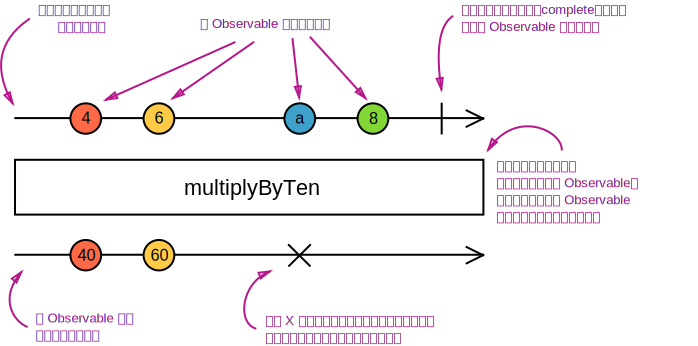

Rxjs（Reactive Extensions for JavaScript）是JavaScript的一个响应式编程库，特别适用于处理一步数据流。

https://developer.aliyun.com/article/1341087?spm=a2c6h.14164896.0.0.2e6d47c5WUwud9&scm=20140722.S_community@@%E6%96%87%E7%AB%A0@@1341087._.ID_1341087-RL_%E5%89%8D%E7%AB%AFrxjs-LOC_search~UND~community~UND~item-OR_ser-V_3-P0_0

RxJS是兼具函数式和响应式两种先进变成风格的框架。
RxJS是一个组织异步逻辑的库，它有很多operator，可以极大的简化异步逻辑的编写。
RxJS中解决异步事件管理的基本概念是：
·Observable（可观察对象）：表示一个可调用的未来值或事件的集合的概念。
·Observer（观察者）：是回调的集合，知道如何监听Observable传递的值。
·Subscription（订阅）：表示Observable的执行，主要用于取消执行。
·Operators（操作符）：采用函数式编程风格的纯函数，支持使用map、filter、concat、reduce等操作处理集合。
·Subject（主体）：相当于一个EventEmitter，是将一个值或事件多播给多个Observers的唯一路径。
·Schedulers（调度器）：是控制并发的集中式调度程序，允许我们在计算发生时进行协调，例如setTimeout或requestAnimationFrame或其它。

#### Observable
被观察者，用来产生消息/数据。
![[./Image/Pasted image 20240806104727.png]]
Observable是多个值的惰性推送集合。本质其实就是一个随事件不断产生数据的一个集合，称之为流更容易理解。

示例：
`var observable = Rx.Observable.create(function (observer) {`
  `observer.next(1);`
  `observer.next(2);`
  `observer.next(3);`
  `setTimeout(() => {`
    `observer.next(4);`
    `observer.complete();`
  `}, 1000);`
`});`

要调用Observable并看到这些值，我们需要订阅Observable：
`var observable = Rx.Observable.create(function (observer) {`
  `observer.next(1);`
  `observer.next(2);`
  `observer.next(3);`
  `setTimeout(() => {`
    `observer.next(4);`
    `observer.complete();`
  `}, 1000);`
`});`
  
`console.log('just before subscribe');`
`observable.subscribe({`
  `next: x => console.log('got value ' + x),`
  `error: err => console.error('something wrong occurred: ' + err),`
  `complete: () => console.log('done'),`
`});`
`console.log('just after subscribe');`

执行结果：
`just before subscribe`
`got value 1`
`got value 2`
`got value 3`
`just after subscribe`
`got value 4`
`done`

##### Pull & Push
什么是Pull：在拉取体系中，由消费者（主动的）来决定何时从生产者那里接收数据。生产者（被动的）本身不知道数据是何时交付到消费者手中的。
什么是Push：在推送体系中，由生产者（主动的）来决定何时把数据发送给消费者。消费者（被动的）本身不知道何时会接受到数据。

##### Observable剖析

**创建Observables**
Rx.Obsercable.create是Observable构造函数的别名，它接受一个参数：subscribe函数。
示例：
`var observable = Rx.Observable.create(function subscribe(observer) {`
  `var id = setInterval(() => {`
    `observer.next('hi')`
  `}, 1000);`
`});`

注：Observables可以使用create来创建，但通常我们使用所谓的创建操作符，像of、from、interval、等等。

**订阅Observables**
示例中的Observable对象observable可以订阅，像这样：
`observable.subscribe(x => console.log(x));`

`observable.subscribe` 和 `Observable.create(function subscribe(observer) {...})` 中的 `subscribe`有着同样的名字，这并不是一个巧合。在库中，它们是不同的，但从实际出发，你可以认为在概念上它们是等同的。
这表明subscribe调用在同一Observable的多个观察者之间是不共享的。当使用一个观察者调用observable.subscribe时，`Observable.create(function subscribe(observer) {...})` 中的 `subscribe` 函数只服务于给定的观察者。对observable.subscribe的每次调用都会触发针对给定观察者的独立设置。

注：订阅Observable像是调用函数，并提供接收数据的回调函数。

**执行Observables**
`Observable.create(function subscribe(observer) {...})` 中`...`的代码表示 “Observable 执行”，它是惰性运算，只有在每个观察者订阅后才会执行。随着时间的推移，执行会以同步或异步的方式产生多个值。

Observable 执行可以传递三种类型的值：
- "Next" 通知： 发送一个值，比如数字、字符串、对象，等等。
- "Error" 通知： 发送一个 JavaScript 错误 或 异常。
- "Complete" 通知： 不再发送任何值。

**清理Observable执行**
当调用了observable.subscribe，观察者会被附加到新创建的Observable执行中。这个调用还返回了一个对象，即Subscription（订阅）：
`var subscription = observable.subscribe(x => console.log(x));`
取消执行：
`var observable = Rx.Observable.from([10, 20, 30]);` 
`var subscription = observable.subscribe(x => console.log(x));` 
`// 稍后：` 
`subscription.unsubscribe();`

当我们使用 `create()` 方法创建 Observable 时，Observable 必须定义如何清理执行的资源。你可以通过在 `function subscribe()` 中返回一个自定义的 `unsubscribe` 函数。
举例来说，这是我们如何清理使用了 `setInterval` 的 interval 执行集合：
`var observable = Rx.Observable.create(function subscribe(observer) {`
  `// 追踪 interval 资源`
  `var intervalID = setInterval(() => {`
    `observer.next('hi');`
  `}, 1000);`

  `// 提供取消和清理 interval 资源的方法`
  `return function unsubscribe() {`
    `clearInterval(intervalID);`
  `};`
`});`

#### Observer(观察者)
观察者是由Observable发送的值的消费者。观察者只是一组回调函数的集合，每个回调函数对应一种Observable发送的通知类型：next、error、和complete。下面的示例是一个典型的观察者对象：
`var observer = {`
  `next: x => console.log('Observer got a next value: ' + x),`
  `error: err => console.error('Observer got an error: ' + err),`
  `complete: () => console.log('Observer got a complete notification'),`
`};`

要使用观察者，需要把它提供给Observable的subscribe方法：
`observable.subscribe(observer);`

#### Subscription(订阅)
Subscription是表示可清理资源的对象，通常是Observable的执行。Subscription有一个重要的方法，即unsubscribe，它不需要任何参数，只是用来清理由Subscription占用的资源。在上一版本的rxjs中，Subscription叫做“Disposable”（可清理对象）。

Subscription还可以合在一起，这样一个Subscription调用unsubscribe()方法，可能有多个Subscription取消订阅。
`var observable1 = Rx.Observable.interval(400);`
`var observable2 = Rx.Observable.interval(300);`
  
`var subscription = observable1.subscribe(x => console.log('first: ' + x));`
`var childSubscription = observable2.subscribe(x => console.log('second: ' + x));`

`subscription.add(childSubscription);`
`setTimeout(() => {`
  `// subscription 和 childSubscription 都会取消订阅`
  `subscription.unsubscribe();`
`}, 1000);`

Subscription还有一个remove(otherSubscription)方法，用来撤销一个已添加的子Subscription。

#### Subject(主体)
Subject是一种特殊类型的Observable，它允许将值多播给多个观察者，所以Subject是多播的，而普通的Observables是单播的（每个已订阅的观察者都拥有Observable的独立执行）。
**每个Subject都是Observable** - 对于Subject你可以提供一个观察者并使用subscribe方法，就可以开始正常接受值。在Subject内部，subscribe不会调用发送值的新执行。它只是将给定的观察者注册到观察者列表中，类似于其他库或语言中的addListener的工作方式（只会接收观察者注册监听之后的值，注册监听之前的值不接收）。
**每个Subject都是观察者** - Subject是一个有有如下方法的对象：next(v)、error(e)和complete()。要给Subject提供新值，只要调用next(theValue)，它会将值多播给已注册监听该Subject的观察者们。
`var subject = new Rx.Subject();`

`subject.subscribe({`
  `next: (v) => console.log('observerA: ' + v)`
`});`
`subject.subscribe({`
  `next: (v) => console.log('observerB: ' + v)`
`});`

`subject.next(1);`
`subject.next(2);`

因为Subject是观察者，所以你也可以把Subject作为参数传给任何Observable的subscribe方法，示例：
`var subject = new Rx.Subject();`

`subject.subscribe({`
  `next: (v) => console.log('observerA: ' + v)`
`});`
`subject.subscribe({`
  `next: (v) => console.log('observerB: ' + v)`
`});`
  
`var observable = Rx.Observable.from([1, 2, 3]);`
  
`observable.subscribe(subject); // 你可以提供一个 Subject 进行订阅`

使用上面的方法，我们只是通过Subject将单播的Observable执行转换为多播的（**Subject本身可以发送和接收，将Subject作为观察者提供给Observable，Observable再通过Subject发送，那么监听Subject就可以接收到Observable的值**）。这也说明Subjects是将任意Observable执行共享给多个观察者的唯一方式。

##### 多播的Observables
“多播Observable”通过Subject来发送通知，这个Subject可能有多个订阅者，然而普通的“单播Observable”只发送给单个观察者。
在底层，这就是multicast操作符的工作原理：观察者订阅一个基础的Subject，然后Subject订阅源Observable。下面的示例与前面使用 `observable.subscribe(subject)` 的示例类似：

`var source = Rx.Observable.from([1, 2, 3]);`
`var subject = new Rx.Subject();`
`var multicasted = source.multicast(subject);`
  
`// 在底层使用了 subject.subscribe({...}):`
`multicasted.subscribe({`
  `next: (v) => console.log('observerA: ' + v)`
`});`
`multicasted.subscribe({`
  `next: (v) => console.log('observerB: ' + v)`
`});`
  
`// 在底层使用了 source.subscribe(subject):`
`multicasted.connect();`

multicast返回一个看起来像普通Observable的Observable，但在订阅时会像Subject一样工作。multicast返回一个ConnectableObservable，它只是一个带有connect()方法的Observable。
connect()方法对于确定共享的Observable何时开始执行非常重要。因为connect()在后台执行source.subscribe(subject)，所以connect()返回一个订阅，你可以退订以取消共享的Observable执行过程。

**引用计数**
手动调用connect()并处理订阅通常很麻烦。通常，我们希望在第一个Observer订阅时自动连接，并在最后一个Observer退订时自动取消共享执行。
通过显式调用connect()来实现这一点：
`import { interval, Subject, multicast } from 'rxjs';`

`const source = interval(500);`
`const subject = new Subject();`
`const multicasted = source.pipe(multicast(subject));`
`let subscription1, subscription2, subscriptionConnect;`

`subscription1 = multicasted.subscribe({`
  `next: (v) => console.log(observerA: ${v}),`
`});`
`// We should call connect() here, because the first`
`// subscriber to multicasted is interested in consuming values`
`subscriptionConnect = multicasted.connect();`

`setTimeout(() => {`
  `subscription2 = multicasted.subscribe({`
    `next: (v) => console.log(observerB: ${v}),`
  `});`
`}, 600);`

`setTimeout(() => {`
  `subscription1.unsubscribe();`
`}, 1200);`

`// We should unsubscribe the shared Observable execution here,`
`// because multicasted would have no more subscribers after this`
`setTimeout(() => {`
  `subscription2.unsubscribe();`
  `subscriptionConnect.unsubscribe(); // for the shared Observable execution`
`}, 2000);`

如果我们希望避免显式调用connect()，可以使用ConnectableObservable的refCount()方法（引用计数），它返回一个Observable来跟踪它有多少订阅者。当订阅者数量从0增加到1时，它会为我们调用connect()，从而开始共享执行，只有当订阅者数量从1减少到0时，它才会完全退订，并停止进一步执行。

例如：
`import { interval, Subject, multicast, refCount } from 'rxjs';`

`const source = interval(500);`
`const subject = new Subject();`
`const refCounted = source.pipe(multicast(subject), refCount());`
`let subscription1, subscription2;`

`// This calls connect(), because`
`// it is the first subscriber to refCounted`
`console.log('observerA subscribed');`
`subscription1 = refCounted.subscribe({`
  `next: (v) => console.log(observerA: ${v}),`
`});`

`setTimeout(() => {`
  `console.log('observerB subscribed');`
  `subscription2 = refCounted.subscribe({`
    `next: (v) => console.log(observerB: ${v}),`
  `});`
`}, 600);`

`setTimeout(() => {`
  `console.log('observerA unsubscribed');`
  `subscription1.unsubscribe();`
`}, 1200);`

`// This is when the shared Observable execution will stop, because`
`// refCounted would have no more subscribers after this`
`setTimeout(() => {`
  `console.log('observerB unsubscribed');`
  `subscription2.unsubscribe();`
`}, 2000);`

`// Logs`
`// observerA subscribed`
`// observerA: 0`
`// observerB subscribed`
`// observerA: 1`
`// observerB: 1`
`// observerA unsubscribed`
`// observerB: 2`
`// observerB unsubscribed`

refCount()方法只存在于ConnectableObservable上，它返回一个Observable，而不是另一个ConnectableObservable。 

##### BehaviorSubject（行为主体）

Subjects的变体之一是BehaviorSubject，它具有“当前值”的概念。它存储发给其消费者的最新值，并且每当有新的Observer订阅时，它将立即从BehaviorSubject接受到“当前值”。

在下面的示例中，BehaviorSubject使用第一个Observer在订阅时收到的值0进行初始化。第二个Observer接收到值2，即使它是在发送值2之后订阅的。
`import { BehaviorSubject } from 'rxjs';`
`const subject = new BehaviorSubject(0); // 0 is the initial value`

`subject.subscribe({`
  `next: (v) => console.log(observerA: ${v}),`
`});`

`subject.next(1);`
`subject.next(2);`

`subject.subscribe({`
  `next: (v) => console.log(observerB: ${v}),`
`});`

`subject.next(3);`

`// Logs`
`// observerA: 0`
`// observerA: 1`
`// observerA: 2`
`// observerB: 2`
`// observerA: 3`
`// observerB: 3`

##### ReplaySubject（重播主体）
ReplaySubject与BehaviorSubject类似，它可以将旧值发送给订阅者，但它也可以记录Observable执行结果的一部分。
ReplaySubject会记录来自Observable执行的多个值，并将他们重播给新订阅者。
创建ReplaySubject时，你可以指定要重播的值的数量：
`import { ReplaySubject } from 'rxjs';`
`const subject = new ReplaySubject(3); // buffer 3 values for new subscribers`

`subject.subscribe({`
  `next: (v) => console.log(observerA: ${v}),`
`});`

`subject.next(1);`
`subject.next(2);`
`subject.next(3);`
`subject.next(4);`

`subject.subscribe({`
  `next: (v) => console.log(observerB: ${v}),`
`});`

`subject.next(5);`

`// Logs:`
`// observerA: 1`
`// observerA: 2`
`// observerA: 3`
`// observerA: 4`
`// observerB: 2`
`// observerB: 3`
`// observerB: 4`
`// observerA: 5`
`// observerB: 5`

除了缓冲区大小之外，你还可以指定一个以毫秒为单位的窗口时间，以确定记录的值可以存在多长时间。在以下示例中，我们使用100个元素的大型缓冲区，但窗口时间参数仅为500毫秒。
`import { ReplaySubject } from 'rxjs';`
`const subject = new ReplaySubject(100, 500 /* windowTime */);`

`subject.subscribe({`
  `next: (v) => console.log(observerA: ${v}),`
`});`

`let i = 1;`
`setInterval(() => subject.next(i++), 200);`

`setTimeout(() => {`
  `subject.subscribe({`
    `next: (v) => console.log(observerB: ${v}),`
  `});`
`}, 1000);`

`// Logs`
`// observerA: 1`
`// observerA: 2`
`// observerA: 3`
`// observerA: 4`
`// observerA: 5`
`// observerB: 3`
`// observerB: 4`
`// observerB: 5`
`// observerA: 6`
`// observerB: 6`
`// ...`

##### AsyncSubject （异步主体）
AsyncSubject时一种变体，其中仅将Observable执行的最后一个值发送给其Observer，并且仅在执行完成时发送。
`import { AsyncSubject } from 'rxjs';`
`const subject = new AsyncSubject();`

`subject.subscribe({`
  `next: (v) => console.log(observerA: ${v}),`
`});`

`subject.next(1);`
`subject.next(2);`
`subject.next(3);`
`subject.next(4);`

`subject.subscribe({`
  `next: (v) => console.log(observerB: ${v}),`
`});`

`subject.next(5);`
`subject.complete();`

`// Logs:`
`// observerA: 5`
`// observerB: 5`

AsyncSubject类似于last()操作符，因为它会等待complete() 通知以传递单个值。

##### void 主体
有时，发出值这件事本身就比发出的值更重要。
例如，下面的代码表示已经过了一秒钟。
`const subject = new Subject<string>();`
`setTimeout(() => subject.next('dummy'), 1000);`

以这种方式传递一个虚拟值很笨拙，并且可能会使用户感到困惑。
通过声明一个**void主体**，你可以表明该值时无所谓的。只有事件本身才重要。
`const subject = new Subject<void>();`
`setTimeout(() => subject.next(), 1000);`

带有上下文的完整示例如下：
`import { Subject } from 'rxjs';`

`const subject = new Subject(); // Shorthand for Subject<void>`

`subject.subscribe({`
  `next: () => console.log('One second has passed'),`
`});`

`setTimeout(() => subject.next(), 1000);`

注：
在版本7之前，Subject值的默认类型时any。`Subject<any>`禁用发出值的类型检查，而`Subject<void>`可以防止意外访问所发出的值。如果你想要老式行为，请将Subject替换为`Subject<any>`。

#### RxJS操作符

##### 什么时操作符？

操作符时函数。有两种操作符：
**可联入管道的操作符**时可以使用语法observableInstance.pipe(operator()) 联入Observables管道的类型。其中包括filter(...)和mergeMap(...)。调用时，它们不会更改现有的Observable实例。相反，它们会返回一个新的Observable，其订阅逻辑时基于第一个Observable的。

可联入管道的操作符是一个以Observable作为输入并返回另一个Observable的函数。这是一个纯操作：之前的Observable保持不变。

可联入管道的操作符本质上是一个纯函数，它将一个Observable作为输入并生成另一个Observable作为输出。定阅此输出的Observable也同时会订阅其输入的Observable。

**创建操作符**是另一类操作符，可以作为独立函数调用以创建新的Observable。例如：of(1, 2, 3)创建一个observable，它将一个接一个的发出1，2和3。
例如：
1）map操作符
`import { of, map } from 'rxjs';`

`of(1, 2, 3)`
  `.pipe(map((x) => x * x))`
  `.subscribe((v) => console.log(value: ${v}));`

`// Logs:`
`// value: 1`
`// value: 4`
`// value: 9`

2）first操作符：
`import { of, first } from 'rxjs';`

`of(1, 2, 3)`
  `.pipe(first())`
  `.subscribe((v) => console.log(value: ${v}));`

`// Logs:`
`// value: 1`

注：map在逻辑上看必须动态构建，因为它必须给出映射函数。作为对比，first可能是一个常数，但仍然是动态构建的。作为一般性的实践，所有操作符都是构造出来的，乌润它们是否需要参数。

##### 管道

可联入管道的操作符都是函数，因此它们可以像普通函数一样使用：op()(obs) --- 但实际上，它们中的大多数往往会纠缠在一起，很快会变得不可读：`op4()(op3()(op2()(op1()(obs))))`。出于这个原因，Observables又一个名为.pipe()的放大，它完成了同样的事情，同时更容易阅读：
`obs.pipe(op1(), op2(), op3(), op4());`
作为一种风格，即使只有一个操作符，也从不使用op()(obs)；obs.pipe(op())是普通的首选项。

##### 创建操作符

与可联入管道的操作符不同，创建操作符一种函数，可用于根据一些常见预定义行为或联合其它Observable来创建一个Observable。
创建操作符的典型示例是interval函数。它将一个数字（而不是Observable）作为输入参数，并产生一个Observable作为输出：
`import { interval } from 'rxjs';`

`const observable = interval(1000 /* number of milliseconds */);`

##### 高阶 Observables

Observables最常发出的是普通值，如字符串和数字，但令人惊讶的是，它还经常需要处理Observables的Observables，即所谓的高阶Observables。例如：
`const fileObservable = urlObservable.pipe(map((url) => http.get(url)));`

http.get()会为每一个单独的URL返回一个Observable（可能是字符串或字符串数组）。现在你有了一个高阶Observable。
但是你如何使用高阶Observable呢？通常，通过展平处理：以某种方式将高阶Observable转换为普通Observable。例如：
`const fileObservable = urlObservable.pipe(`
  `map((url) => http.get(url)),`
  `concatAll()`
`);`

concatAll()操作符订阅从外部Observable出来的每一个内部Observable，并复制所有发出的值，直到该Observable完成，然后继续处理下一个。所有值都以这种方式连接。其他有用的展平操作符（称为联结操作符）有：
- mergeAll() — 在每个内部Observable抵达时订阅它，然后在每个值抵达时发出这个值
- switchAll() — 在第一个内部Observable抵达时订阅它，然后在每个值抵达时发出这个值，但是当下一个内部Observable抵达时，退订前一个，并订阅新的。
- exhaustAll() — 在第一个内部Observable抵达时订阅它，并在每个值抵达时发出这个值，丢弃所有新抵达的内部Observsble直到第一个完成，然后等待下一个内部Observable。

正如许多数组库会将map()和flat()（或flatten()）组合成一个flatMap()一样，所有RxJS展平操作符都有其映射的等价物：concatMap()、mergeMap()、switchMap()和exhaustMap().

##### 弹珠图

##### 操作符的分类

https://rxjs.tech/guide/operators#categories-of-operators

##### 创建自定义操作符

使用pipe() 函数创建新的操作符
https://rxjs.tech/guide/operators#creating-new-operators-from-scratch

#### 调度器

